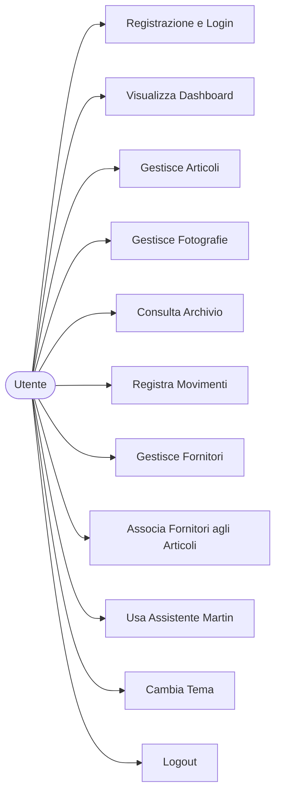
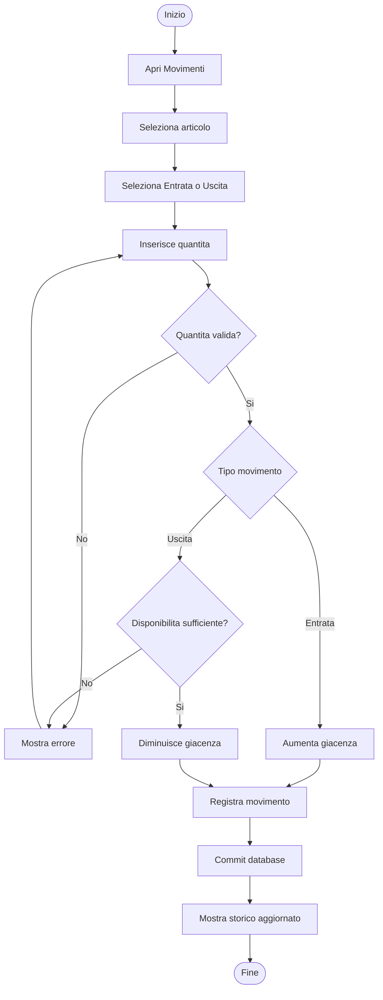
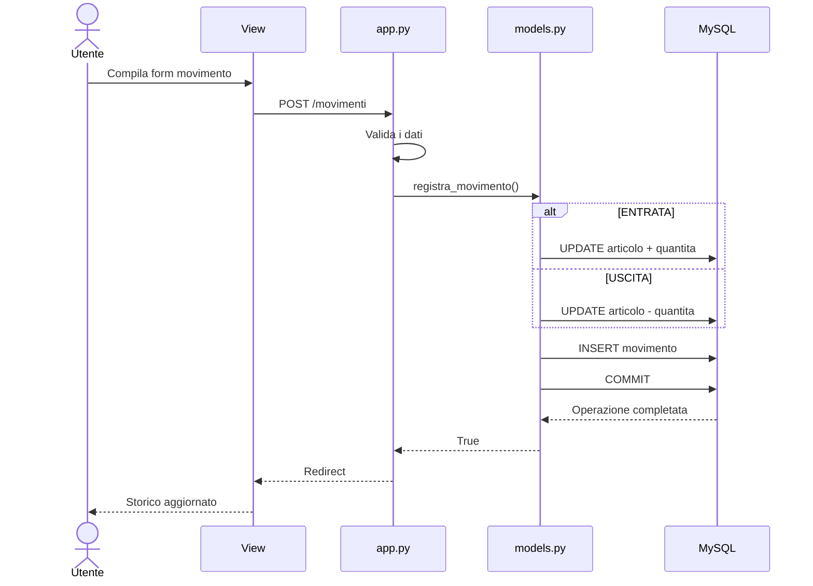
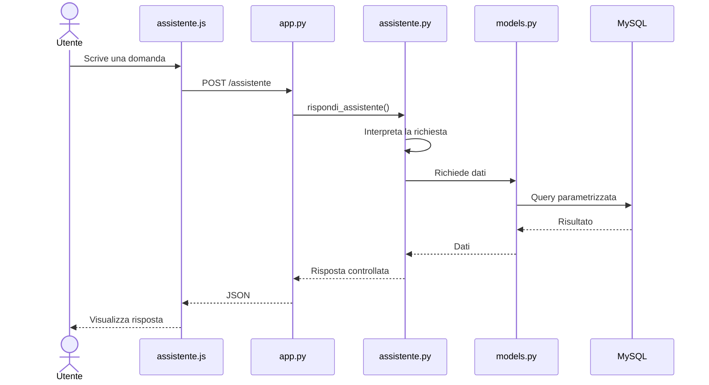
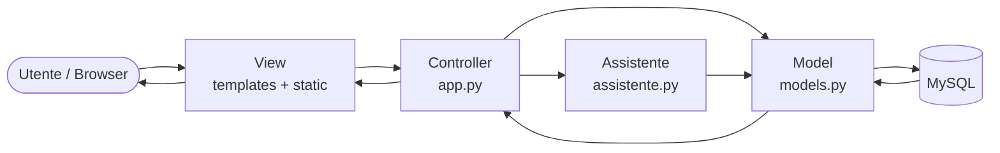
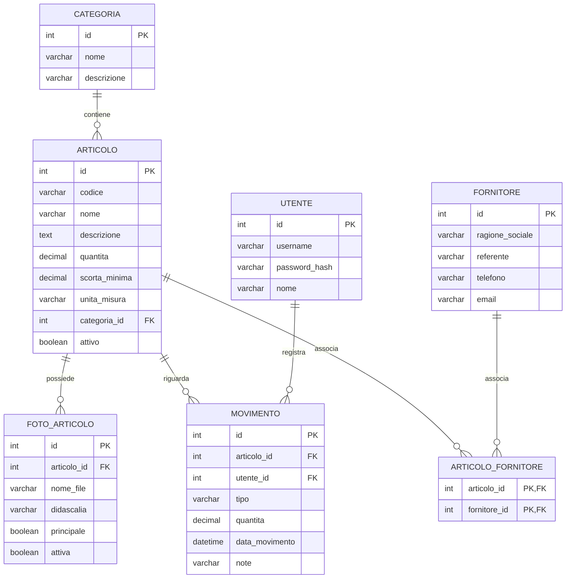

# DISMAT Mini Magazzino

Applicazione web didattica per la gestione di un piccolo magazzino interno, sviluppata con Python, Flask e MySQL.

Il sistema gestisce articoli, giacenze, movimenti, fornitori, fotografie, autenticazione e un assistente interno denominato Martin.

## Funzionalita principali

- registrazione utenti;
- login e logout;
- protezione delle pagine tramite sessione Flask;
- dashboard con dati reali;
- gestione articoli;
- archivio e riattivazione degli articoli;
- gestione della scorta minima;
- registrazione di entrate e uscite;
- aggiornamento automatico della giacenza;
- storico dei movimenti;
- controllo della disponibilita prima di un'uscita;
- gestione fornitori;
- relazione molti-a-molti tra articoli e fornitori;
- caricamento e gestione fotografie;
- foto principale dell'articolo;
- tema chiaro e scuro;
- interfaccia responsive;
- assistente Martin con ricerca controllata sui dati del sistema.

## Architettura

Il progetto segue una struttura ispirata al modello MVC.

### Controller

`app.py`

Gestisce:

- route Flask;
- richieste GET e POST;
- form;
- sessioni;
- autenticazione;
- validazioni;
- redirect;
- endpoint JSON dell'assistente.

### Model

`models.py`

Contiene le funzioni Python che comunicano con MySQL e le query SQL relative a:

- articoli;
- categorie;
- utenti;
- fotografie;
- movimenti;
- fornitori;
- relazioni articolo-fornitore.

Le query utilizzano parametri `%s`.

`db.py`

Gestisce la connessione MySQL tramite `get_db()` e legge i parametri dal file `.env`.

### Logica assistente

`assistente.py`

Contiene la logica di Martin.

Martin utilizza una ricerca controllata sugli articoli e sui fornitori, con supporto a confronti approssimativi tramite `SequenceMatcher`.

Non genera query SQL libere e non inventa dati: le informazioni vengono recuperate tramite le funzioni presenti nel Model.

### View

`templates/`

Contiene i template HTML e Jinja2.

`static/`

Contiene CSS, JavaScript, immagini e file caricati.

## Struttura progetto

```text
dismat-magazzino/
|
|-- app.py
|-- models.py
|-- db.py
|-- assistente.py
|-- test_db.py
|
|-- database/
|   `-- schema.sql
|
|-- templates/
|   |-- base.html
|   |-- index.html
|   |-- articoli.html
|   |-- nuovo_articolo.html
|   |-- modifica_articolo.html
|   |-- dettaglio_articolo.html
|   |-- archivio_articoli.html
|   |-- movimenti.html
|   |-- fornitori.html
|   |-- nuovo_fornitore.html
|   |-- modifica_fornitore.html
|   |-- login.html
|   `-- register.html
|
|-- static/
|   |-- css/
|   |   `-- style.css
|   |-- js/
|   |   |-- theme.js
|   |   `-- assistente.js
|   |-- images/
|   |   |-- logo-dismat.jpeg
|   |   `-- martin.png
|   `-- uploads/
|       `-- .gitkeep
|
|-- .env.example
|-- .gitignore
|-- requirements.txt
`-- README.md

## Diagrammi UML e modello ER

La documentazione di progetto comprende:

- Use Case Diagram;
- Activity Diagram;
- Sequence Diagram dei movimenti;
- Sequence Diagram dell'assistente Martin;
- schema dell'architettura MVC;
- diagramma ER del database;
- cardinalita delle relazioni.

I diagrammi completi sono disponibili in:

[docs/diagrammi.md](docs/diagrammi.md)


---

# Diagrammi UML e modello ER

## Use Case Diagram



## Activity Diagram - Registrazione di un movimento



## Sequence Diagram - Movimento



## Sequence Diagram - Assistente Martin



## Architettura MVC



## Diagramma ER



## Cardinalita del database

```text
CATEGORIA  1 ----- N  ARTICOLO

ARTICOLO   1 ----- N  FOTO_ARTICOLO

ARTICOLO   1 ----- N  MOVIMENTO

UTENTE     1 ----- N  MOVIMENTO

ARTICOLO   N ----- M  FORNITORE
                  |
                  |
          ARTICOLO_FORNITORE
```

La relazione molti-a-molti tra `ARTICOLO` e `FORNITORE` viene risolta attraverso la tabella associativa `ARTICOLO_FORNITORE`.

