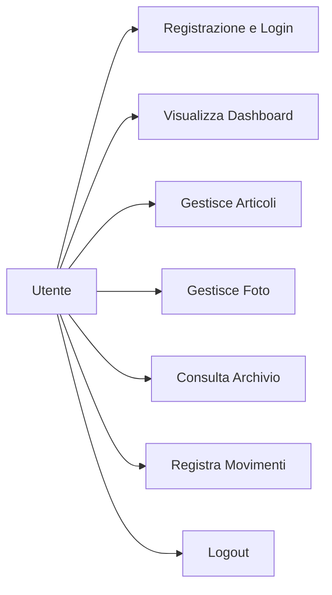
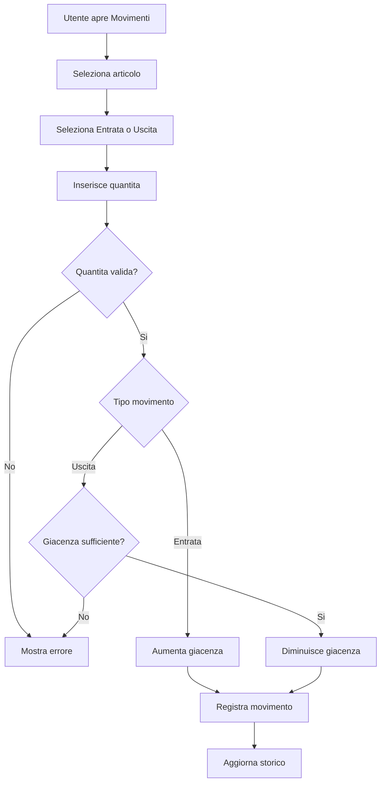
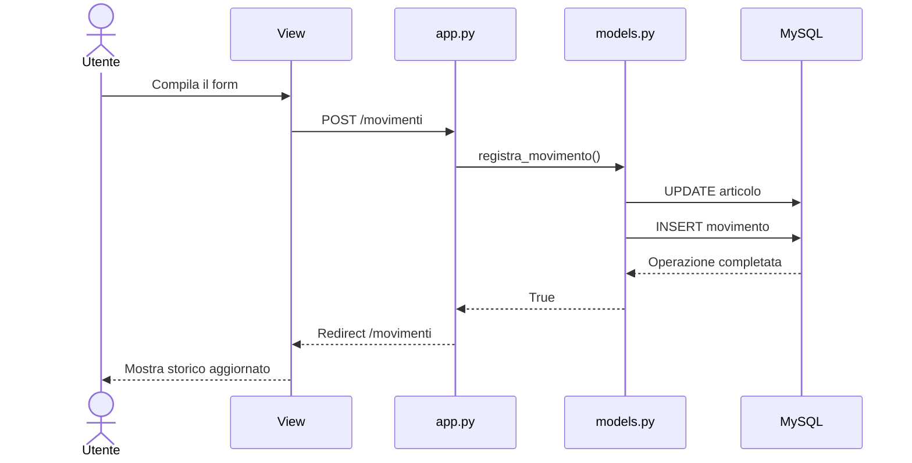
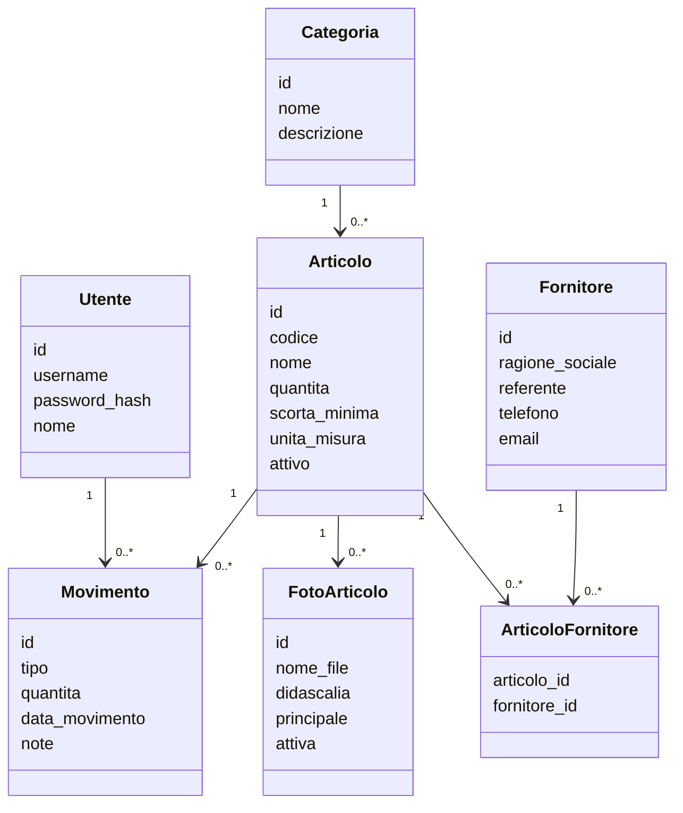

# DISMAT Mini Magazzino

Applicazione web didattica per la gestione di un piccolo magazzino, realizzata con Flask e MySQL.

## Struttura MVC

### CONTROLLER
app.py

Gestisce:
- route Flask
- richieste GET e POST
- form
- sessione
- login e logout
- redirect
- collegamento tra Model e View

### MODEL
models.py

Contiene:
- funzioni Python per l'accesso ai dati
- query SQL
- gestione articoli
- gestione utenti
- gestione movimenti

db.py

Gestisce la connessione al database MySQL tramite get_db().

### VIEW
templates/

Contiene le pagine HTML e i template Jinja2.

static/

Contiene:
- CSS
- JavaScript
- immagini
- file caricati

## Schema

Browser
  |
  v
Controller - app.py
  |
  +--> Model - models.py
  |       |
  |       v
  |     MySQL
  |
  v
View - templates + static
  |
  v
Browser

## Tecnologie

- Python
- Flask
- MySQL
- Jinja2
- Bootstrap 5
- CSS
- JavaScript
- Werkzeug
- python-dotenv
- mysql-connector-python

## Principio del progetto

Il progetto è mantenuto volutamente semplice: poche funzioni, responsabilità chiare e codice facilmente leggibile e spiegabile.

## Albero del progetto

```text
dismat-magazzino/
|
|-- app.py                  CONTROLLER
|-- models.py               MODEL
|-- db.py                   Supporto database
|
|-- templates/              VIEW
|   |-- base.html
|   |-- index.html
|   |-- articoli.html
|   |-- nuovo_articolo.html
|   |-- modifica_articolo.html
|   |-- dettaglio_articolo.html
|   |-- archivio_articoli.html
|   |-- movimenti.html
|   |-- login.html
|   `-- register.html
|
|-- static/                 VIEW
|   |-- css/
|   |-- js/
|   |-- images/
|   `-- uploads/
|
|-- requirements.txt
|-- .gitignore
`-- README.md
```

## Diagrammi UML

### Use Case



### Activity Diagram - Registrazione di un movimento



### Sequence Diagram - Registrazione di un movimento



### Modello delle entita


