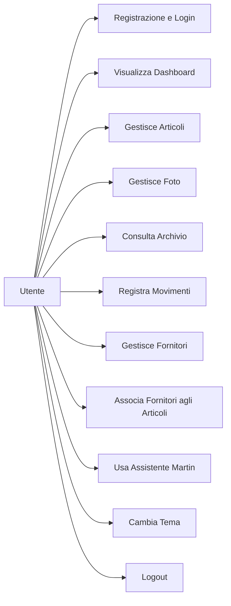
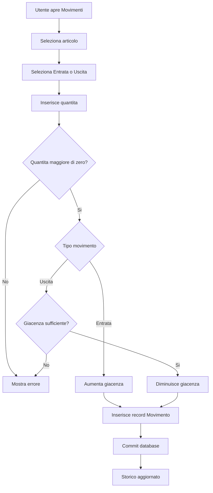
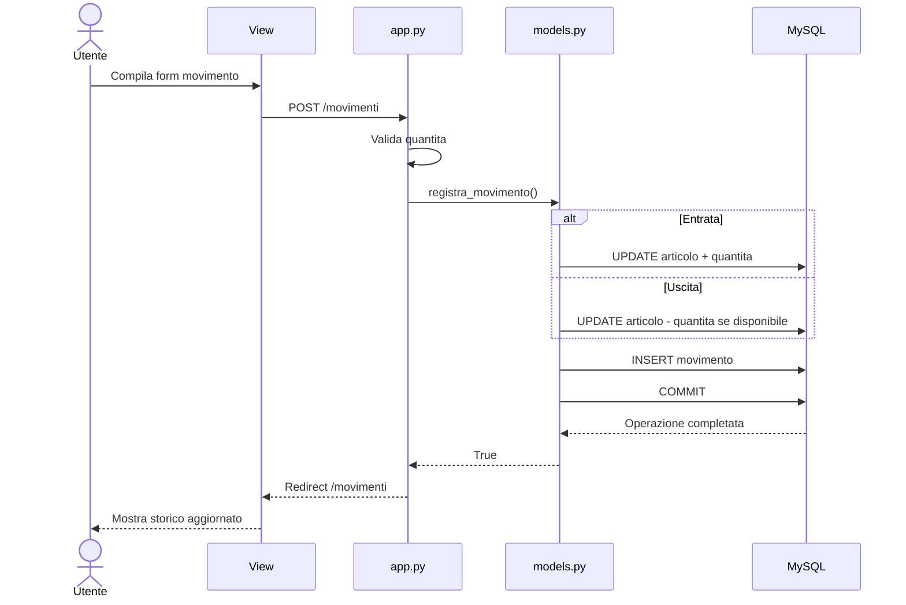
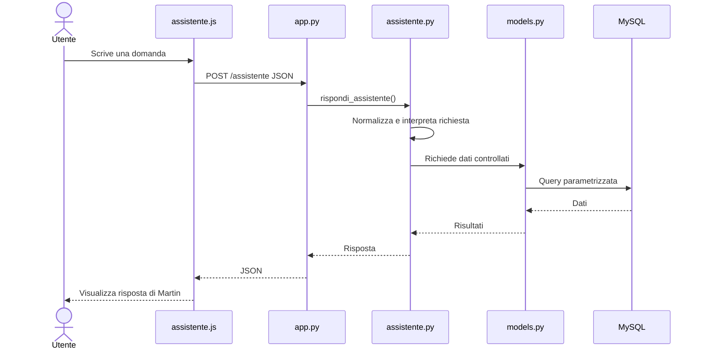
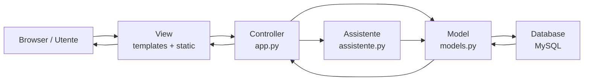
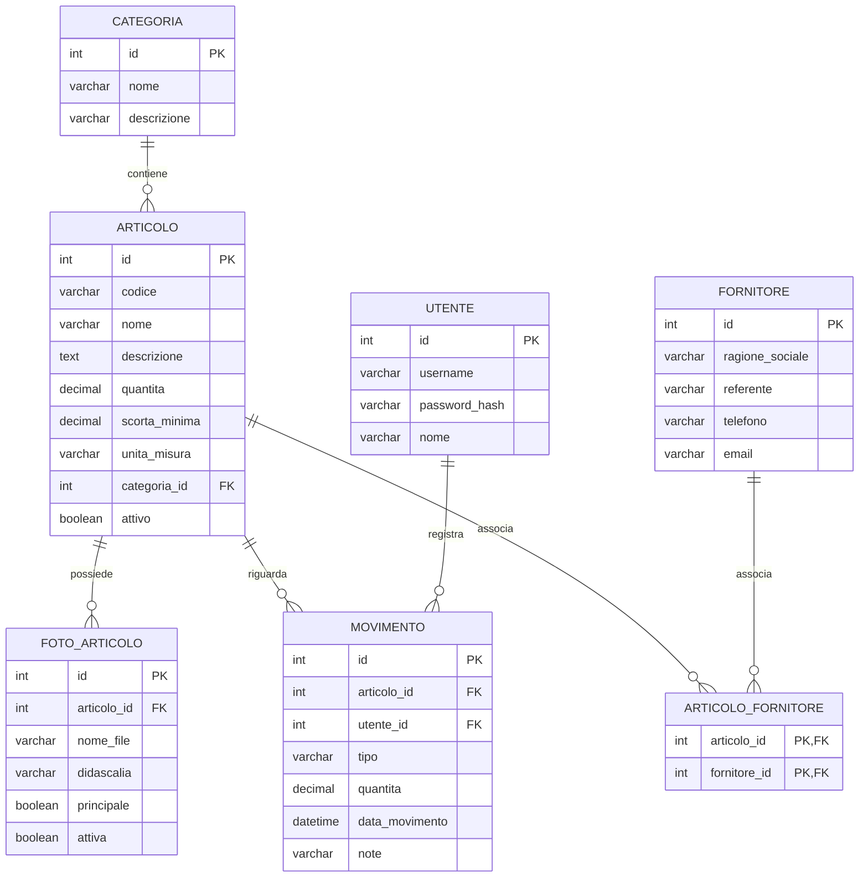

# Diagrammi UML e modello ER

Questo documento raccoglie i principali diagrammi di analisi e progettazione del progetto DISMAT Mini Magazzino.

---

# 1. Use Case Diagram



---

# 2. Activity Diagram - Registrazione movimento



---

# 3. Sequence Diagram - Registrazione movimento



---

# 4. Sequence Diagram - Assistente Martin



---

# 5. Diagramma MVC



---

# 6. Diagramma ER - Entity Relationship



---

# 7. Cardinalita principali

| Relazione | Cardinalita | Significato |
|---|---|---|
| Categoria - Articolo | 1:N | Una categoria puo contenere molti articoli |
| Articolo - Foto | 1:N | Un articolo puo avere piu fotografie |
| Articolo - Movimento | 1:N | Un articolo puo essere coinvolto in molti movimenti |
| Utente - Movimento | 1:N | Un utente puo registrare molti movimenti |
| Articolo - Fornitore | N:M | Un articolo puo avere piu fornitori e un fornitore puo fornire piu articoli |

La relazione N:M tra ARTICOLO e FORNITORE viene risolta tramite la tabella associativa ARTICOLO_FORNITORE.

---

# 8. Schema logico sintetico

```text
CATEGORIA
    1
    |
    N
ARTICOLO
    |
    +------ 1:N ------ FOTO_ARTICOLO
    |
    +------ 1:N ------ MOVIMENTO ------ N:1 ------ UTENTE
    |
    +------ 1:N ------ ARTICOLO_FORNITORE ------ N:1 ------ FORNITORE
```

---

## Nota progettuale

Il progetto utilizza una struttura modulare e prevalentemente procedurale.

I diagrammi UML rappresentano il comportamento e l'architettura dell'applicazione, mentre il diagramma ER descrive la struttura relazionale del database MySQL.
